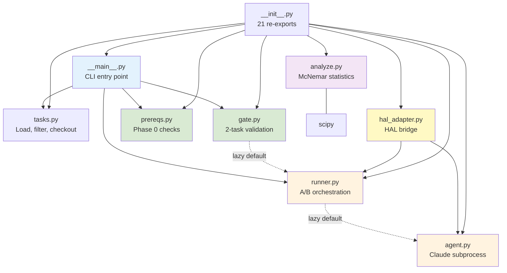
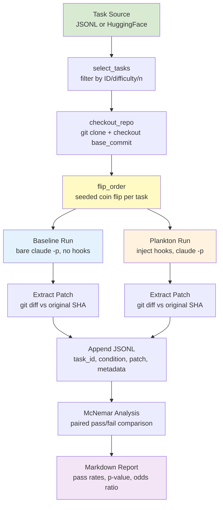

# SWE-bench Benchmark Subsystem

## TL;DR

- **Purpose**: Paired A/B benchmark measuring Plankton hook
  impact on SWE-bench task resolution via Claude Code
- **Scope**: `benchmark/swebench/` (8 Python modules + CLI),
  `tests/unit/` (10 files, 256 tests),
  `tests/integration/` (7 files, 30 tests)
- **Key responsibilities**:
  - Drive Claude CLI to solve SWE-bench tasks under two
    conditions: `baseline` (bare, no hooks) vs `plankton`
    (hooks active)
  - Orchestrate paired A/B runs with seeded ordering,
    repo reset, hook injection/removal, JSONL persistence
  - Statistical analysis via McNemar's test for paired
    nominal data
  - Phase 0 prerequisite validation (11 static + 4 live)
  - 2-task validation gate before full 50-task runs
  - HAL harness adapter for external evaluation
- **Dependencies**: `scipy` (McNemar), Claude CLI,
  optional `datasets` (HuggingFace task loading)

## Scope & Context

- **Goals**: Quantify whether write-time linting hooks
  improve SWE-bench resolve rates; reproducible via
  seeded ordering and pinned tool versions
- **Non-goals**: Evaluating linter rule correctness;
  testing Claude Code runtime; cross-model comparison
  (planned Phase 4)
- **Upstream**: Claude Code runtime (`claude -p` CLI),
  SWE-bench task definitions, HAL evaluation harness
- **Downstream**: Statistical reports (McNemar), JSONL
  result archives, patch files per task/condition
- **Operating model**: Sequential per-task A/B with
  randomized condition order; abort criteria for
  infra errors, empty patches, sustained 429s
- **ADR**: `docs/specs/benchmarks/adr-plankton-benchmark.md`

## Module Dependency Diagram

## Data Flow Diagram

## Core Components

### agent.py (Claude Subprocess Wrapper)

- **Location**: `benchmark/swebench/agent.py` (~215 lines)
- **Responsibilities**: Spawn `claude -p` per task, extract
  patches, parse output, handle TTY workaround
- **Public API**: `solve(input_data, *, condition, model,
  timeout, dry_run=False) -> dict`
- **Implementation**:
  - Writes prompt to `.swebench_prompt.txt` (large-stdin
    workaround via `cat | claude`)
  - TTY workaround: wraps in `script -q /dev/null sh -c ...`
  - Baseline injects `--setting-sources "" --settings
    bare-settings.json --strict-mcp-config
    --disable-slash-commands`
  - Both conditions: `--disallowedTools WebFetch,WebSearch,Task`
  - `_extract_patch`: SHA-anchored `git diff` to handle
    cases where Claude commits during solve
  - `_parse_claude_output`: JSON parse with fallback;
    `error_type=infra` when returncode != 0 AND JSON invalid
  - Cost tracking: extracts `cost_usd` from top-level or
    nested `usage.cost_usd`
  - `dry_run=True`: skips `git rev-parse HEAD` and Claude
    subprocess; returns stub result with `metadata.dry_run=True`
- **Conditions**: `baseline` (bare, no hooks) vs `plankton`
  (hooks active); raises `ValueError` on unknown condition

### runner.py (A/B Orchestration)

- **Location**: `benchmark/swebench/runner.py` (~329 lines)
- **Responsibilities**: Paired A/B runs, hook management,
  JSONL persistence, abort criteria, resume support
- **Public API**:
  - `run_task(task, *, seed, model, ...) -> dict`
  - `run_all(tasks, *, seed, model, ..., dry_run=False) -> dict`
  - `flip_order(task_id, seed) -> tuple[str, str]`
  - `inject_hooks(task_dir, plankton_root)`
  - `remove_hooks(task_dir)`
  - `load_completed_ids(results_dir) -> set[str]`
- **Implementation**:
  - Seeded `random.Random(f"{seed}:{task_id}")` for
    deterministic condition ordering
  - `inject_hooks` copies `.claude/hooks/` + config files
    (`.ruff.toml`, `ty.toml`, `.claude/subprocess-settings.json`)
  - `remove_hooks` cleans up injected files + empty `.claude/`
  - `run_task` resets repo between conditions, catches solve
    exceptions as synthetic infra errors, writes 2 JSONL + 2 patches
  - `run_all` safety: raises `RuntimeError` if `CLAUDE.md`
    exists (must rename to `.bak`)
  - 3 abort criteria: >20% infra error rate, 10 consecutive
    empty patches, 600s sustained 429s
  - `load_completed_ids`: requires BOTH conditions present
    per task; validates condition names; resilient to
    malformed JSONL lines

### gate.py (Validation Gate)

- **Location**: `benchmark/swebench/gate.py` (~300 lines)
- **Responsibilities**: 2-task dry run with 6 automated
  criteria before full benchmark run
- **Public API**:
  - `run_gate(tasks, config, ...) -> GateResult`
  - `format_gate_report(result) -> str`
- **6 criteria**:
  1. No crash or timeout (no `error_type=infra`)
  2. Patches non-empty
  3. Hook activity (PostToolUse/hook/linter in output;
     skipped when all plankton conditions are dry-run stubs)
  4. Eval harness verdicts populated (deferred if not run;
     skippable via `skip_eval` config flag)
  5. Patches differ between conditions (at least 1 task)
  6. Cost and time within bounds (wall < 7200s, cost < $5)
- **Dataclasses**: `CriterionResult`, `GateConfig` (with
  `dry_run: bool = False`, `skip_eval: bool = False`),
  `GateResult`

### analyze.py (Statistical Analysis)

- **Location**: `benchmark/swebench/analyze.py` (~165 lines)
- **Responsibilities**: Load paired results, McNemar's test,
  markdown report generation
- **Public API**:
  - `compute_mcnemar(baseline_pass, plankton_pass, all_tasks)
    -> dict`
  - `load_paired_results(baseline_path, plankton_path) -> dict`
  - `load_paired_results_from_combined(path) -> dict`
  - `generate_report(paired, metadata) -> str`
- **Implementation**:
  - McNemar via `scipy.stats.binomtest` on discordant pairs
  - Returns `p_value=1.0` when no discordant pairs
  - Orphaned tasks (missing one condition) filtered with
    `logging.warning`
  - Report includes directional flip labels
    ("fail->pass" / "pass->fail")

### prereqs.py (Phase 0 Checks)

- **Location**: `benchmark/swebench/prereqs.py` (~391 lines)
- **Responsibilities**: Validate environment before benchmark
  execution — 11 static checks + 4 optional live checks
- **Public API**:
  - `run_all_checks(*, plankton_root, full_mode, **overrides)
    -> list[PrereqResult]`
  - `format_report(results) -> str`
- **11 static checks** (steps 1-11): claude version, bare
  alias, hooks dir, settings file, CLAUDE.md absent, script
  binary, eval harness, permission flags, tool blocklist,
  concurrency probe, archive clean
- **4 live checks** (full mode): zero-hook baseline, TTY
  workaround, large stdin, tool blocklist enforcement
- **All functions** accept injectable kwargs (`run_fn`,
  `which_fn`, `settings_path`, `plankton_root`) for testing
- Exception per-check: caught, returns `step=0`
- `shutil.which` guard on all live checks before subprocess

### tasks.py (Task Loading)

- **Location**: `benchmark/swebench/tasks.py` (~146 lines)
- **Responsibilities**: Load tasks from JSONL or HuggingFace,
  filter by ID/difficulty/count, checkout repos
- **Public API**:
  - `load_tasks_from_jsonl(path) -> list[dict]`
  - `load_tasks_from_hf(dataset, split, ...) -> list[dict]`
  - `select_tasks(tasks, *, instance_ids, difficulties, n)
    -> list[dict]`
  - `checkout_repo(task, repos_dir, ...) -> dict`
  - `prepare_tasks(tasks, repos_dir, ...) -> list[dict]`
- Validates required fields (`instance_id`, `problem_statement`)
- `checkout_repo`: clones to `owner__repo` dir, checks out
  `base_commit`, returns task dict with `repo_dir`

### hal_adapter.py (HAL Bridge)

- **Location**: `benchmark/swebench/hal_adapter.py` (~101 lines)
- **Responsibilities**: Bridge HAL harness
  `run(input, **kwargs)` API to Plankton's `solve()`
- **Public API**: `run(input, **kwargs) -> dict[str, str]`
- **Implementation**:
  - Iterates `{instance_id: task_data}`, calls `_run_instance`
  - Injects hooks for plankton condition, removes in `finally`
  - Metadata to `hal_metadata.jsonl` (write failures caught)
  - `inject_hooks` failures propagate; `remove_hooks` failures
    caught (do not abort)

### \_\_main\_\_.py (CLI)

- **Location**: `benchmark/swebench/__main__.py` (~120 lines)
- **Invocation**: `python -m benchmark.swebench {gate,run,prereqs}`
- **Subcommands**:
  - `gate`: 2-task validation → exit 0/1 (extra: `--skip-eval`)
  - `run`: Full A/B benchmark with `--resume` support → exit 0/1
  - `prereqs`: Phase 0 checks with optional `--full` → exit 0/1
- **Shared flags**: `--repos-dir`, `--tasks-jsonl`, `--tasks-hf`,
  `--instance-ids`, `--difficulties`, `--seed` (default 42),
  `--model`, `--timeout`, `--no-checkout`, `--dry-run`,
  `--results-dir`

### \_\_init\_\_.py (Package Facade)

- **Location**: `benchmark/swebench/__init__.py` (~35 lines)
- **Exports**: 21 symbols in `__all__` covering all public API
  from all 6 sibling modules

## Data Model

- **Task dict**: `{instance_id, problem_statement, repo,
  base_commit, difficulty?, repo_dir?}` — `repo_dir` added
  by `checkout_repo`
- **Solve result**: `{patch, condition, passed: None,
  metadata: {elapsed_s, cost_usd, error?, error_type?}}`
- **JSONL record**: `{task_id, condition, passed, patch,
  ...metadata}` — one line per task/condition pair
- **PrereqResult**: `dataclass(name, passed, detail, step)`
- **CriterionResult**: `dataclass(name, passed, detail)`
- **GateConfig**: `dataclass(seed, model, timeout,
  results_dir, patches_dir, dry_run, skip_eval)`
- **GateResult**: `dataclass(passed, criteria, tasks_run,
  wall_time_s, results_dir)`

## Test Coverage

### Unit Tests (256 tests, 10 files)

| File | Tests | Coverage |
| --- | --- | --- |
| `test_swebench_prereqs.py` | 53 | 15 checks, run_all, format, version |
| `test_swebench_runner.py` | 49 | flip, reset, hooks, abort, resume, dry_run |
| `test_swebench_agent.py` | 36 | cmd, solve, parse, patch, cost, dry_run |
| `test_swebench_gate.py` | 33 | 6 criteria, run_gate, format, dry_run |
| `test_hal_adapter.py` | 26 | dispatch, hooks, errors, metadata, validation |
| `test_swebench_tasks.py` | 21 | JSONL/HF loading, select, checkout, prepare |
| `test_swebench_analyze.py` | 18 | McNemar, paired, report, validation |
| `test_swebench_main.py` | 17 | parser, dispatch, exit codes, resume |
| `test_swebench_integration.py` | 2 | package exports, end-to-end mock |
| `test_smoke.py` | 1 | import smoke test |

### Integration Tests (30 tests, 7 files)

| File | Tests | Coverage |
| --- | --- | --- |
| `test_cli_wiring.py` | 12 | CLI dispatch, gate/run end-to-end, dry_run/skip |
| `test_abort_wiring.py` | 4 | consecutive empty, infra rate, exceptions |
| `test_task_validation.py` | 4 | missing fields, custom checkout_fn |
| `test_resume_flow.py` | 3 | skip completed, partial not skipped, full cycle |
| `test_hooks_robustness.py` | 3 | missing source, file-not-dir, partial |
| `test_gate_runner_chain.py` | 2 | gate-through-runner, kwargs forwarding |
| `test_e2e_pipeline.py` | 2 | JSONL-to-report, pipeline with resume |

### Shared Fixtures

- `tests/unit/conftest.py`: `tmp_git_repo`, `mock_completed_process`
- `tests/integration/conftest.py`: `tmp_git_repo`, `fake_task`,
  `write_tasks_jsonl`, `mock_solve_fn` (with plankton hook
  evidence in stderr)

## Operations

- **Prereqs check**: `python -m benchmark.swebench prereqs [--full]`
- **Gate run**: `python -m benchmark.swebench gate --repos-dir DIR`
- **Full run**: `python -m benchmark.swebench run --repos-dir DIR`
- **Resume**: `python -m benchmark.swebench run --repos-dir DIR --resume`
- **Tests**: `.venv/bin/python -m pytest tests -x -v` (286 tests)
- **HAL harness**: `hal-eval` with `hal_adapter.run` entry point

## Archive

- **Location**: `benchmark/archive/`
- **Contents**: Original Phase 1 EvalPlus/ClassEval benchmark
  code — `runner.py`, `analyze.py`, `classeval_wrapper.py`,
  `evalplus_wrapper.py`, test files, `ClassEval_data.json`,
  sample results
- **Status**: Archived; Phase 1 complete; superseded by
  SWE-bench infrastructure

## Risks, Tech Debt, Open Questions

- **No eval harness in CI**: `hal-eval`/`sb` not available
  in GitHub Actions; gate and run tests use mocked solve
- **Benchmark deps isolated**: `scipy`, `datasets`,
  `evalplus` in `[dependency-groups] benchmark` (PEP 735);
  `dev` group includes them via `include-group`
- **prereqs.sh parallel**: Bash `prereqs.sh` (337 lines)
  duplicates Python `prereqs.py` with slight differences
  (shell alias check, concurrency probe); consider removing
- **Single-threaded runs**: Tasks run sequentially; no
  parallelism support yet (Phase 3 target)
- **Patch extraction fragility**: `git diff` may miss
  changes if Claude uses non-standard git operations
- **CLAUDE.md safety check**: `run_all` raises if file
  exists; requires manual rename to `.bak` before run
